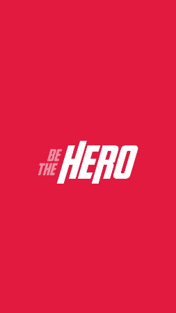

<!-- então bora codar! -->

<h1 align="center">
    
</h1>

<h2 align="center"> Aplicação para conectar ONGs e outras instituições a pessoas que tem disponibilidade para ajudar </h2>

<h3 align="center"> Criada com as tecnologias  React,  React Native,  Node e  SQLite </h3>

<p align="center">  </p>

---

Um sistema para conectar pessoas dispostas a ajudar a ONGs que precisam dessa ajuda.

## Para rodar a aplicação

> OBS: pode-se utilizar o gerenciador de pacotes npm ou o yarn para rodar os comandos abaixo

Execute ```npm install``` nas pastas backend, frontend e mobile, para instalar as dependências.

Rode ```npm start``` nas pastas backend e frontend para utilizar a versão web. Acesse via **localhost:3000**.

Rode ```npm start``` nas pastas backend e mobile, acesse **localhost:19002**, leia o QR Code no seu celular e utilize o aplicativo  Expo para rodar a versão mobile no seu smartphone. Ou com algum emulador Android/iOS para rodar no seu computador.

## Telas

<div align="center">
    
    
</div>

<div align="center">
    
    
</div>

---

**&copy;  [Rocketseat](https://rocketseat.com.br/)**

**Instrutor: [Diego Fernandes](https://github.com/diego3g) | CTO Rocketseat**
---

<h4 align="center"> <em>&lt;/&gt;</em> by <a href="https://github.com/gabrielcarmo-s" target="_blank">Gabriel Carmo</a> </h4>
 
